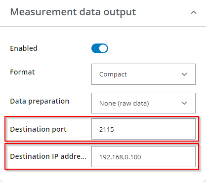
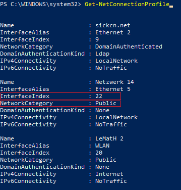
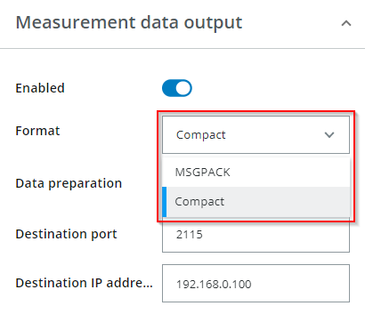
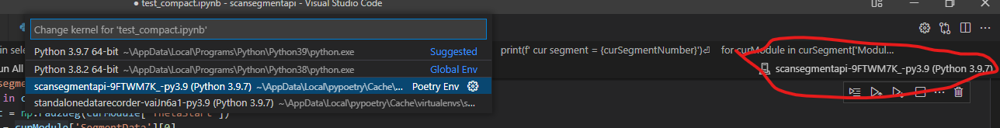

# ScanSegmentAPI

This project contains scripts written in Python which receive and parse scan segments from SICK LiDAR sensors, either in the Compact or in the MSGPACK format.

The following product families are currently supported:
- multiScan100 (e.g. 1131164)
- picoScan100 (e.g. 1134610)

The scripts which do the actual parsing are located in `api/msgpack.py` and `api/compact.py` respectively. They are written and documented with the intention to support the understanding of the two data formats. The scripts are not optimized for performance and not intended to be used in productive code.

To quickly test that data from a SICK LiDAR sensor is received successfully on your client, the [command line tool](#using-the-command-line-interface) `scansegmentapi.py` can be used. Hints for the configuration of the sensor and the network of the client PC can be found [here](#hints-on-sensor-and-network-configuration).

To use the parsers in a python script, this package can simply be imported as shown in the [examples below](#using-the-scansegmentapi-from-python).

Finally, sample binary files with MSGPACK data and Compact data are provided in ´tests/sample_files´. They can be used to check whether the parsing results of your own parser  match with the results of the scripts provided here. Some documentation on the sample binary files is found in [tests/sample_files/README.md](/tests/sample_files/README.md).

## Prerequisites

This project relies on [Poetry](https://python-poetry.org/) for dependency management and execution of the virtual
python environment. Detailed installation instructions for each platform can be found
[here](https://python-poetry.org/docs/).

## Project setup

To install the project dependencies run:

```bash
$ poetry install
```

## Using the command-line interface scansegmentapi.py

In general all Python scripts must be executed via Poetry either in a single command:

```bash
$ poetry run python <script1>
$ poetry run python <script2>
$ ...
```

or by first starting the Poetry shell:

```bash
$ poetry shell
$ python <script1>
$ python <script2>
$ ...
```

You can always view help with the built-in help option `--help, -h`:

```bash
$ poetry run python scansegmentapi.py -h
```

This will display a list of the available subcommands. Further help on the subcommands and their options can be retrieved
using:

```bash
$ poetry run python scansegmentapi.py <subcommand> -h
```

If no device is at hand, one of the provided sample files can be used to test if the project was correctly set up using
the `read` subcommand.

```bash
$ poetry run python scansegmentapi.py read msgpack -i ./tests/sample_files/sample.msgpack
$ poetry run python scansegmentapi.py read compact -i ./tests/sample_files/sample.compact
```

### Receiving data from a device

To receive segments sent by a SICK Lidar sensor the `receive` subcommand has to be used as follows:

```bash
$ poetry run python scansegmentapi.py receive compact # or 'msgpack' respectively.
```

By default this command listens on
`localhost` at port `2115` for incoming data. If the device is located in a different subnetwork the host address to
use for listening can be changed using the `--host` command-line option. Note that the host address is the ip address of the network adapter of the client PC, not of the sensor. The port can be changed using `-p` or `--port`
flag:

```bash
$ poetry run python scansegmentapi.py receive compact --host 192.168.0.100 --port 2115 # or 'msgpack' respectively.
```


## Using the ScanSegmentAPI from Python
To receive data from a SICK Lidar sensor in a Python script, the ScanSegmentAPI can be imported and the parsers can be instantiated.

Example for MSGPACK where the address `192.168.0.100` is the ip address of the network adapter of the client PC (not of the sensor!) and `2115` is the used port.

```python
import scansegmentapi.api.msgpack as MSGPACKApi

if __name__ == "__main__":
    receiver = MSGPACKApi.Receiver(port=2115, host="192.168.0.100")
    (segments, frameNumbers, segmentCounters) = receiver.receiveSegments(200)
    receiver.closeConnection()

```

Example for Compact where the address `192.168.0.100` is the ip address of the network adapter of the client PC (not of the sensor!) and `2115` is the used port.

```python
import scansegmentapi.api.compact as CompactApi

if __name__ == "__main__":
    receiver = CompactApi.Receiver(port=2115, host="192.168.0.100")
    (segments, frameNumbers, segmentCounters) = receiver.receiveSegments(200)
    receiver.closeConnection()
```

---
**NOTE**

The above snippets assume that code of the ScanSegmentAPI is located in a subdirectory of the current working directory named `scansegmentapi`. If you place your code directly in the directory with the ScanSegmentAPI code for example, the import statement has to be modified to `import api.msgpack` and `import api.compact` respectively.

---

## Examples
More examples of the usage of the ScanSegmentAPI can be found in the examples directory.

## Compact & MSGPACK API mapping table

The following table shows all information contained in a MSGPACK or Compact UDP package as described in the chapters "MSGPACK format" and "Compact format" of the data format description PDF which can be downloaded from sick.com.


**Legend:**
- *E* stands for a specific echo number
- *M* stands for a specific module number
- *SC* stands for a specific scan number within a module, which is used in the Compact format
- *SM* stands for a specific scan number within a segment, which is used in the MSGPACK format
- *B* stands for a specific beam
- *segment* is a single received segment

|                   Compact                        |      Data access to Compact packages using the ScanSegmentAPI      |               MSGPACK                |      Data access to MSGPACK packages using the ScanSegmentAPI      |
|:-------------------------------------------------|:------------------------------------------------------|:-------------------------------------|:------------------------------------------------------|
| Header: StartOfFrame                             | -                                                     | Framing: StartOfFrame                | -                                                     |
| Header: CommandId                                | segment["CommandId"]                                  | -                                    | -                                                     |
| -                                                | -                                                     | Framing: MSGPACK buffer              | -                                                     |
| Header: TelegramCounter                          | segment["TelegramCounter"]                            | ScanSegment: TelegramCounter         | segment["TelegramCounter"]                            |
| Header: TimeStampTransmit                        | segment["TimestampTransmit"]                          | ScanSegment: TimeStampTransmit       | segment["TimestampTransmit"]                          |
| Header: TelegramVersion                          | segment["Version"]                                    | -                                    | -                                                     |
| Header: SizeModule0                              | -                                                     | -                                    | -                                                     |
| MetaData Module *M*: SegmentCounter              | segment["Modules"][*M*]["SegmentCounter"]             | ScanSegment: SegmentCounter          | segment["SegmentCounter"]                             |
| MetaData Module *M*: FrameNumber                 | segment["Modules"][*M*]["FrameNumber"]                | ScanSegment: FrameNumber             | segment["FrameNumber"]                                |
| MetaData Module *M*: SenderId                    | segment["Modules"][*M*]["SenderId"]                   | ScanSegment: SenderId                | segment["SenderId"]                                   |
| MetaData Module *M*: NumberOfLinesInModule       | segment["Modules"][*M*]["NumberOfLinesInModule"]      | -                                    | -                                                     |
| MetaData Module *M*: NumberOfBeamsPerScan        | segment["Modules"][*M*]["NumberOfBeamsPerScan"]       | Scan *SM*: BeamCount              | segment["SegmentData"][*SM*]["BeamCount"]             |
| MetaData Module *M*: NumberOfEchosPerBeam        | segment["Modules"][*M*]["NumberOfEchosPerBeam"]       | Scan *SM*: EchoCount              | segment["SegmentData"][*SM*]["EchoCount"]             |
| MetaData Module *M*: TimeStampStart              | segment["Modules"][*M*]["TimestampStart"][*SC*]       | Scan *SM*: TimeStampStart            | segment["SegmentData"][*SM*]["TimestampStart"]        |
| MetaData Module *M*: TimeStampStop               | segment["Modules"][*M*]["TimestampStop"][*SC*]        | Scan *SM*: TimeStampStop             | segment["SegmentData"][*SM*]["TimestampStop"]         |
| MetaData Module *M*: Phi                         | segment["Modules"][*M*]["Phi"][*SC*]                  | Scan *SM*: ChannelPhi                | segment["SegmentData"][*SM*]["Phi"]                   |
| MetaData Module *M*: ThetaStart                  | segment["Modules"][*M*]["ThetaStart"][*SC*]           | Scan *SM*: ThetaStart                | segment["SegmentData"][*SM*]["ThetaStart"]            |
| MetaData Module *M*: ThetaStop                   | segment["Modules"][*M*]["ThetaStop"][*SC*]            | Scan *SM*: ThetaStop                 | segment["SegmentData"][*SM*]["ThetaStop"]             |
DistanceScanlingFactor                              | segment["Modules"][*M*]["DistanceScalingFactor"]      | -                 | -
| MetaData Module *M*: NextModuleSize              | -             | -                                    | -                                                     |
| MetaData Module *M*: Reserved 1                  | -                                                     | -                                    | -                                                     |
| MetaData Module *M*: DataContentEchos            | segment["Modules"][*M*]["DataContentEchos"]           | -                                    | -                                                     |
| MetaData Module *M*: DataContentBeams            | segment["Modules"][*M*]["DataContentBeams"]           | -                                    | -                                                     |
| MetaData Module *M*: Reserved2                   | -                                                     | -                                    | -                                                     |
| MeasurementData Module *M* Beam *B* Echo *E*: Distance  | segment["Modules"][*M*]["SegmentData"][*SC*]["Distance"][*E* ][*B*]        | Scan *SM*: DistValues *E* *B*    | segment["SegmentData"][*SM*]["Distance"][*E* ][*B*]    |
| MeasurementData Module *M* Beam *B* Echo *E*: RSSI      | segment["Modules"][*M*]["SegmentData"][*SC*]["Rssi"][*E* ][*B*]            | Scan *SM*: RssiValues *E* *B*    | segment["SegmentData"][*SM*]["Rssi"][*E* ][*B*]        |
| MeasurementData Module *M* Beam *B*: Properties| segment["Modules"][*M*]["SegmentData"][*SC*]["Properties"][*B* ]           | Scan *SM*: PropertyValues *E* *B*| segment["SegmentData"][*SM*]["Propertiesv"][*B*]       |
| MeasurementData Module *M* Beam *B*: Theta     | segment["Modules"][*M*]["SegmentData"][*SC*]["ChannelTheta"]  [*B* ]       | Scan *SM*: ChannelTheta *E* *B*  | segment["SegmentData"][*SM*]["ChannelTheta"]           |
| -                                                 | -                                                     | ScanSegment: Availability            | segment["Availability"]                               |
| -                                                 | -                                                     | ScanSegment: LayerId                 | segment["LayerId"][*SM*]                              |
| -                                                 | -                                                     | Scan *SM*: ScanNumber                | segment["SegmentData"][*SM*]["ScanNumber"]            |
| -                                                 | -                                                     | Scan *SM*: ModuleId                  | segment["SegmentData"][*SM*]["ModuleID"]              |
| -                                                 | -                                                     | Framing: MSGPACK buffer size         | -                                                     |
| Framing: CRC                                      | -                                                     | Framing: CRC                         | -                                                     |


## Hints on sensor and network configuration

If no data can be received from a SICK Lidar sensor or errors are reported in the data stream, here are some hints how to solve common problems.

### Configure correct IP adress and port
If no data is received at all, make sure that the correct port and the correct IP address of the client PC are configured on the sensor.



### Set network category to 'Private'

On Windows PCs the network category of the used network adapter has to be configured to 'Private'. To do so, open the Windows Powershell with administrator privileges and check the network category and the interface index of the network adapter which is used for communication with the Lidar sensor.




Then set the network category to 'Private' for the corresponding interface using the following command:

`Set-NetConnectionProfile -InterfaceIndex <index as retrived> -NetworkCategory Private`

### Configure correct data format
If data is received but a CRC check error is shown as output of the Python script, a reason might be that the wrong output data format is configured on the sensor. Make sure that MSGPACK output is configured when using the MSGPACK Python api and Compact is configured when using the Compact Python API.



## Jupyter Notebook support in Visual Studio Code

In order to use the api inside Jupyter notebooks executed inside Visual Studio Code the appropriate virtual environment
has to be selected as shown in the image below:



In many cases, Visual Stuio Code recognizes the correct virtual environment by itself.

## Dependencies

This module relies on the following dependencies which are downloaded during the build process

| Name               | Version   | License                                                 | URL                                          |
|--------------------|-----------|---------------------------------------------------------|----------------------------------------------|
| certifi            | 2023.7.22 | [Mozilla Public License 2.0 (MPL 2.0)](https://mozilla.org/MPL/2.0/)     | https://github.com/certifi/python-certifi    |
| charset-normalizer | 3.3.0     | [MIT License](https://spdx.org/licenses/MIT.html)                        | https://github.com/Ousret/charset_normalizer |
| colorama           | 0.4.6     | [BSD-3-Clause License](https://spdx.org/licenses/BSD-3-Clause.html)      | https://github.com/tartley/colorama          |
| coverage           | 7.3.2     | [Apache-2.0 License](http://www.apache.org/licenses/LICENSE-2.0)         | https://github.com/nedbat/coveragepy         |
| exceptiongroup     | 1.1.3     | [MIT License](https://spdx.org/licenses/MIT.html)                        | https://github.com/agronholm/exceptiongroup  |
| idna               | 3.4       | [BSD-3-Clause License](https://spdx.org/licenses/BSD-3-Clause.html)      | https://github.com/kjd/idna                  |
| iniconfig          | 2.0.0     | [MIT License](https://spdx.org/licenses/MIT.html)                        | https://github.com/pytest-dev/iniconfig      |
| msgpack            | 1.0.7     | [Apache-2.0 License](http://www.apache.org/licenses/LICENSE-2.0)         | https://msgpack.org/                         |
| numpy              | 1.25.2    | [BSD-3-Clause License](https://spdx.org/licenses/BSD-3-Clause.html)      | https://www.numpy.org                        |
| packaging          | 23.2      | [Apache-2.0 License](http://www.apache.org/licenses/LICENSE-2.0); [BSD-3-Clause](https://spdx.org/licenses/BSD-3-Clause.html)               | https://github.com/pypa/packaging            |
| pluggy             | 1.3.0     | [MIT License](https://spdx.org/licenses/MIT.html)                        | https://github.com/pytest-dev/pluggy         |
| pytest             | 7.4.2     | [MIT License](https://spdx.org/licenses/MIT.html)                        | https://docs.pytest.org/en/latest/           |
| pytest-cov         | 4.1.0     | [MIT License](https://spdx.org/licenses/MIT.html)                        | https://github.com/pytest-dev/pytest-cov     |
| requests           | 2.31.0    | [Apache-2.0 License](http://www.apache.org/licenses/LICENSE-2.0)         | https://requests.readthedocs.io              |
| scansegmentdecoding   | 2.0.4     | [MIT License](https://spdx.org/licenses/MIT.html)                        | https://github.com/SICKAG/scansegmentdecoding |
| tomli              | 2.0.1     | [MIT License](https://spdx.org/licenses/MIT.html)                        | https://github.com/hukkin/tomli              |
| urllib3            | 2.0.6   | [MIT License](https://spdx.org/licenses/MIT.html)                        | https://urllib3.readthedocs.io/              |