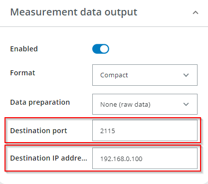
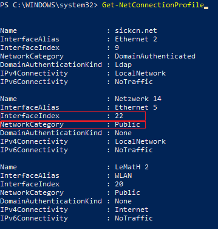
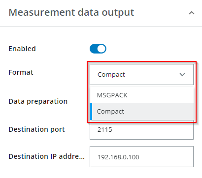
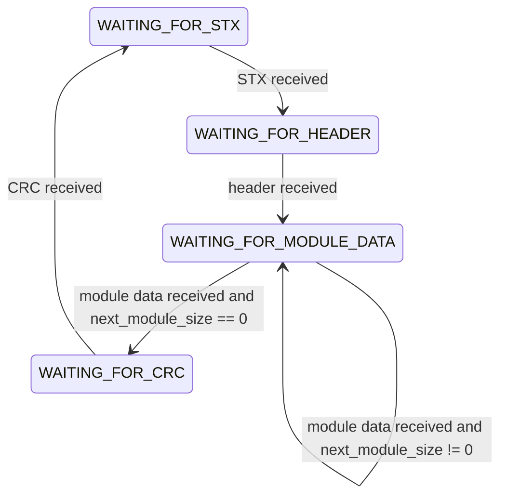
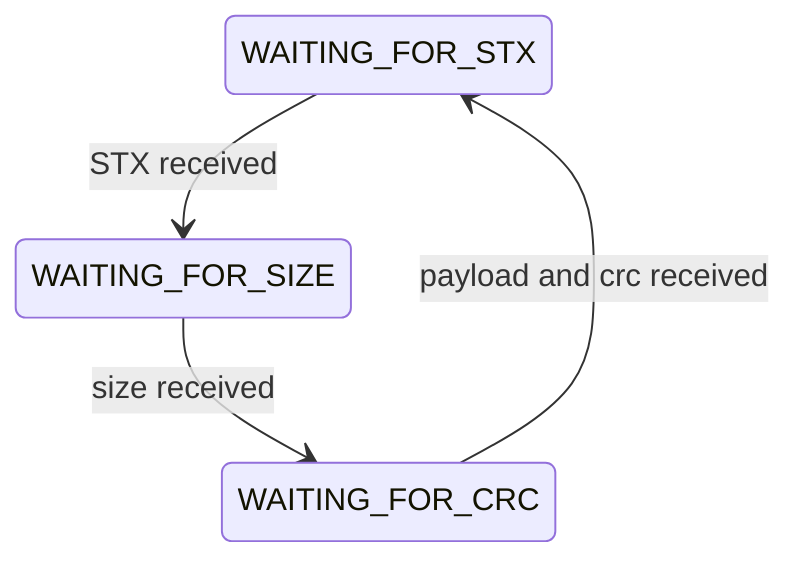

<div align="center">


<br/>

# ScanSegmentAPI

This project contains scripts written in Python which receive and parse scan segments from SICK LiDAR sensors, either in the Compact format telegram type 1 (recommended) or in the MSGPACK format. The transport protocols UDP and TCP are supported.


[](LICENSE)
[](https://github.com/SICKAG/ScanSegmentAPI)
[](https://github.com/SICKAG/ScanSegmentAPI)
[](https://github.com/SICKAG/ScanSegmentAPI/issues)

[🔄 Change Log](CHANGELOG.md)

</div>

<details>
  <summary><strong style="font-size:1.25em">Table of contents</strong></summary>

- [Supported product families](#supported-product-families)
- [Introduction](#introduction)
- [Prerequisites](#prerequisites)
- [Project setup](#project-setup)
- [Quick start](#quick-start)
- [Executing Python scripts in a Poetry environment](#executing-python-scripts-in-a-poetry-environment)
- [Using the command line interface scansegmentapi cli](#using-the-command-line-interface-scansegmentapi-cli)
  - [Receiving data from a device](#receiving-data-from-a-device)
- [Using the ScanSegmentAPI from Python](#using-the-scansegmentapi-from-python)
- [Examples](#examples)
- [Compact format telegram type 1 \& MSGPACK API mapping table](#compact-format-telegram-type-1--msgpack-api-mapping-table)
- [Hints on sensor and network configuration](#hints-on-sensor-and-network-configuration)
  - [Configure correct IP address and port](#configure-correct-ip-address-and-port)
  - [Set network category to 'Private'](#set-network-category-to-private)
  - [Configure correct data format](#configure-correct-data-format)
- [Extracting data packages from a TCP stream](#extracting-data-packages-from-a-tcp-stream)
- [Dependencies](#dependencies)

</details>

## Supported product families

- multiScan100 (e.g. 1131164)
- picoScan100 (e.g. 1134610)
- LRS4000 (e.g. 1098855)

## Introduction

The scripts which do the actual parsing are located in `scansegmentapi/msgpack.py` and `scansegmentapi/compact.py` respectively. They are written and documented with the intention to support the understanding of the two data formats. The scripts are not optimized for performance and not intended to be used in productive code.

To quickly test that data from a SICK LiDAR sensor is received successfully on your client, the [command line tool](#using-the-command-line-interface-scansegmentapi-cli) `scansegmentapi_cli.py` can be used. Hints for the configuration of the sensor and the network of the client PC can be found in the [sensor and network configuration hints](#hints-on-sensor-and-network-configuration).

To use the parsers in a python script, this package can simply be imported as shown in the [examples below](#using-the-scansegmentapi-from-python).

Finally, sample binary files with MSGPACK data and Compact format telegram type 1 data are provided in `tests/sample_files`. They can be used to check whether the parsing results of your own parser match with the results of the scripts provided here. Some documentation on the sample binary files is found in [tests/sample_files/README.md](tests/sample_files/README.md).

## Prerequisites

Install [Poetry](https://python-poetry.org/), the tool this project uses for dependency and virtual-environment management. Follow the [official installation guide](https://python-poetry.org/docs/#installation) for your platform.

> [!NOTE]
> **Windows: Poetry not found after install** The installer may not update your `PATH` automatically. Add the it manually and reopen the terminal.

## Project setup

Open a terminal and change into folder:

```bash
cd scansegmentapi
```

> [!NOTE]
> `pyproject.toml` is Poetry's project configuration file (lists dependencies, Python version, etc.). It lives in this same folder. Every `poetry` command must be run from here, otherwise Poetry cannot find the project.

Install the dependencies:

```bash
poetry install
```

## Quick start

After running `poetry install` you can immediately verify your setup without a physical sensor by parsing the included sample files:

```bash
poetry run python scansegmentapi_cli.py read compact -i ./tests/sample_files/sample.compact
poetry run python scansegmentapi_cli.py read msgpack -i ./tests/sample_files/sample.msgpack
```

If both commands print scan-segment data without errors, your installation is working correctly.

## Executing Python scripts in a Poetry environment

In general all Python scripts must be executed via Poetry either in a single command:

```bash
poetry run python <script1>
poetry run python <script2>
...
```

## Using the command line interface scansegmentapi cli

You can always view help with the built-in help option `--help, -h`:

```bash
poetry run python scansegmentapi_cli.py -h
```

This will display a list of the available subcommands. Further help on the subcommands and their options can be retrieved
using:

```bash
poetry run python scansegmentapi_cli.py <subcommand> -h
```

If no device is at hand, one of the provided sample files can be used to test if the project was correctly set up using
the `read` subcommand.

```bash
poetry run python scansegmentapi_cli.py read msgpack -i ./tests/sample_files/sample.msgpack
poetry run python scansegmentapi_cli.py read compact -i ./tests/sample_files/sample.compact
```

### Receiving data from a device

To receive segments sent by a SICK Lidar sensor the `receive` subcommand has to be used as follows:

```bash
poetry run python scansegmentapi_cli.py receive compact # or 'msgpack' respectively.
```

By default this command listens on `localhost` at port `2115` for incoming data via UDP.
If the device is located in a different subnetwork the ip address to use for listening can be changed using the `--ip` command-line option.
Note that depending on the transport protocol, the ip address is the ip address of the network adapter of the client PC, if UDP is used, or the ip address of the sensor, if TCP is used.

The port can be changed using `-p` or `--port` flag:

```bash
poetry run python scansegmentapi_cli.py receive compact --ip 192.168.0.100 --port 2115
```

The transport protocol can be selected between UDP and TCP using the `--protocol` argument. The default is UDP. For the protocols supported by your device refer to the manual.

> [!WARNING]
> After running `receive`, the command silently waits for incoming data and produces no output until the first segment arrives. If nothing appears after a few seconds, the sensor is likely not yet sending data to this host. Refer to the [Hints on sensor and network configuration](#hints-on-sensor-and-network-configuration) section for common causes and fixes (wrong IP address, wrong port, UDP firewall category, wrong data format).

## Using the ScanSegmentAPI from Python

To receive data from a SICK Lidar sensor in a Python script, the ScanSegmentAPI can be imported and the parsers can be instantiated.

Example for MSGPACK via UDP where the address `192.168.0.100` is the ip address of the network adapter of the client PC (not of the sensor!) and `2115` is the used port.

```python
import scansegmentapi.msgpack as MSGPACKApi
from scansegmentapi.udp_handler import UDPHandler

if __name__ == "__main__":
    transportLayer = UDPHandler("192.168.0.100", 2115, 65535)
    receiver = MSGPACKApi.Receiver(transportLayer)
    (segments, frameNumbers, segmentCounters) = receiver.receive_segments(200)
    receiver.close_connection()

```

Example for Compact format telegram type 1 via UDP where the address `192.168.0.100` is the ip address of the network adapter of the client PC (not of the sensor!) and `2115` is the used port.

```python
import scansegmentapi.compact as CompactApi
from scansegmentapi.udp_handler import UDPHandler

if __name__ == "__main__":
    transportLayer = UDPHandler("192.168.0.100", 2115, 65535)
    receiver = CompactApi.Receiver(transportLayer)
    (segments, frameNumbers, segmentCounters) = receiver.receive_segments(200)
    receiver.close_connection()
```

Example for Compact format telegram type 1 via TCP where the address `192.168.0.1` is the ip address of the sensor (not of the client PC!) and `2115` is the used port of the sensor.

```python
import scansegmentapi.compact as CompactApi
from scansegmentapi.tcp_handler import TCPHandler
from scansegmentapi.compact_stream_extractor import CompactStreamExtractor

if __name__ == "__main__":
    streamExtractor = CompactStreamExtractor()
    transportLayer = TCPHandler(streamExtractor, "192.168.0.100", 2115, 1024)
    receiver = CompactApi.Receiver(transportLayer)
    (segments, frameNumbers, segmentCounters) = receiver.receive_segments(200)
    receiver.close_connection()
```

> [!NOTE]
> The above snippets use the package import path `scansegmentapi.X` (e.g. `scansegmentapi.compact`), which is correct when the package is installed via `poetry install` or when your script is placed outside the `scansegmentapi` source directory.

## Examples

More examples of the usage of the ScanSegmentAPI can be found in the examples directory.

## Compact format telegram type 1 & MSGPACK API mapping table

The following table shows all information contained in a MSGPACK or Compact format telegram type 1 UDP package as described in the chapters "MSGPACK format" and "Compact format telegram type 1 format" of the data format description PDF which can be downloaded from sick.com.

**Legend:**

- _E_ stands for a specific echo number
- _M_ stands for a specific module number
- _SC_ stands for a specific scan number within a module, which is used in the Compact format telegram type 1 format
- _SM_ stands for a specific scan number within a segment, which is used in the MSGPACK format
- _B_ stands for a specific beam
- _segment_ is a single received segment

| Compact format telegram type 1                         | Data access to Compact format telegram type 1 packages using the ScanSegmentAPI | MSGPACK                           | Data access to MSGPACK packages using the ScanSegmentAPI |
| :----------------------------------------------------- | :------------------------------------------------------------------------------ | :-------------------------------- | :------------------------------------------------------- |
| Header: StartOfFrame                                   | -                                                                               | Framing: StartOfFrame             | -                                                        |
| Header: CommandId                                      | segment["CommandId"]                                                            | -                                 | -                                                        |
| -                                                      | -                                                                               | Framing: MSGPACK buffer           | -                                                        |
| Header: TelegramCounter                                | segment["TelegramCounter"]                                                      | ScanSegment: TelegramCounter      | segment["TelegramCounter"]                               |
| Header: TimeStampTransmit                              | segment["TimestampTransmit"]                                                    | ScanSegment: TimeStampTransmit    | segment["TimestampTransmit"]                             |
| Header: TelegramVersion                                | segment["Version"]                                                              | -                                 | -                                                        |
| Header: SizeModule0                                    | -                                                                               | -                                 | -                                                        |
| MetaData Module _M_: SegmentCounter                    | segment["Modules"][_M_]["SegmentCounter"]                                       | ScanSegment: SegmentCounter       | segment["SegmentCounter"]                                |
| MetaData Module _M_: FrameNumber                       | segment["Modules"][_M_]["FrameNumber"]                                          | ScanSegment: FrameNumber          | segment["FrameNumber"]                                   |
| MetaData Module _M_: SenderId                          | segment["Modules"][_M_]["SenderId"]                                             | ScanSegment: SenderId             | segment["SenderId"]                                      |
| MetaData Module _M_: NumberOfLinesInModule             | segment["Modules"][_M_]["NumberOfLinesInModule"]                                | -                                 | -                                                        |
| MetaData Module _M_: NumberOfBeamsPerScan              | segment["Modules"][_M_]["NumberOfBeamsPerScan"]                                 | Scan _SM_: BeamCount              | segment["SegmentData"][_SM_]["BeamCount"]                |
| MetaData Module _M_: NumberOfEchosPerBeam              | segment["Modules"][_M_]["NumberOfEchosPerBeam"]                                 | Scan _SM_: EchoCount              | segment["SegmentData"][_SM_]["EchoCount"]                |
| MetaData Module _M_: TimeStampStart                    | segment["Modules"][_M_]["TimestampStart"][_SC_]                                 | Scan _SM_: TimeStampStart         | segment["SegmentData"][_SM_]["TimestampStart"]           |
| MetaData Module _M_: TimeStampStop                     | segment["Modules"][_M_]["TimestampStop"][_SC_]                                  | Scan _SM_: TimeStampStop          | segment["SegmentData"][_SM_]["TimestampStop"]            |
| MetaData Module _M_: Phi                               | segment["Modules"][_M_]["Phi"][_SC_]                                            | Scan _SM_: ChannelPhi             | segment["SegmentData"][_SM_]["Phi"]                      |
| MetaData Module _M_: ThetaStart                        | segment["Modules"][_M_]["ThetaStart"][_SC_]                                     | Scan _SM_: ThetaStart             | segment["SegmentData"][_SM_]["ThetaStart"]               |
| MetaData Module _M_: ThetaStop                         | segment["Modules"][_M_]["ThetaStop"][_SC_]                                      | Scan _SM_: ThetaStop              | segment["SegmentData"][_SM_]["ThetaStop"]                |
| DistanceScanlingFactor                                 | segment["Modules"][_M_]["DistanceScalingFactor"]                                | -                                 | -                                                        |
| MetaData Module _M_: NextModuleSize                    | -                                                                               | -                                 | -                                                        |
| MetaData Module _M_: Reserved 1                        | -                                                                               | -                                 | -                                                        |
| MetaData Module _M_: DataContentEchos                  | segment["Modules"][_M_]["DataContentEchos"]                                     | -                                 | -                                                        |
| MetaData Module _M_: DataContentBeams                  | segment["Modules"][_M_]["DataContentBeams"]                                     | -                                 | -                                                        |
| MetaData Module _M_: Reserved2                         | -                                                                               | -                                 | -                                                        |
| MeasurementData Module _M_ Beam _B_ Echo _E_: Distance | segment["Modules"][_M_]["SegmentData"][_SC_]["Distance"][_E_ ][_B_]             | Scan _SM_: DistValues _E_ _B_     | segment["SegmentData"][_SM_]["Distance"][_E_ ][_B_]      |
| MeasurementData Module _M_ Beam _B_ Echo _E_: RSSI     | segment["Modules"][_M_]["SegmentData"][_SC_]["Rssi"][_E_ ][_B_]                 | Scan _SM_: RssiValues _E_ _B_     | segment["SegmentData"][_SM_]["Rssi"][_E_ ][_B_]          |
| MeasurementData Module _M_ Beam _B_: Properties        | segment["Modules"][_M_]["SegmentData"][_SC_]["Properties"][_B_ ]                | Scan _SM_: PropertyValues _E_ _B_ | segment["SegmentData"][_SM_]["Propertiesv"][_B_]         |
| MeasurementData Module _M_ Beam _B_: Theta             | segment["Modules"][_M_]["SegmentData"][_SC_]["ChannelTheta"][_B_ ]              | Scan _SM_: ChannelTheta _E_ _B_   | segment["SegmentData"][_SM_]["ChannelTheta"]             |
| -                                                      | -                                                                               | ScanSegment: Availability         | segment["Availability"]                                  |
| -                                                      | -                                                                               | ScanSegment: LayerId              | segment["LayerId"][_SM_]                                 |
| -                                                      | -                                                                               | Scan _SM_: ScanNumber             | segment["SegmentData"][_SM_]["ScanNumber"]               |
| -                                                      | -                                                                               | Scan _SM_: ModuleId               | segment["SegmentData"][_SM_]["ModuleID"]                 |
| -                                                      | -                                                                               | Framing: MSGPACK buffer size      | -                                                        |
| Framing: CRC                                           | -                                                                               | Framing: CRC                      | -                                                        |

## Hints on sensor and network configuration

If no data can be received from the device or errors are reported in the data stream, here are some hints how to solve common problems.

### Configure correct IP address and port

If no data is received at all when using UDP, make sure that the correct port and the correct IP address of the client PC are configured on the sensor.



If no data is received at all when using TCP, make sure that the correct port and the correct IP address of the sensor is configured in the python script.

### Set network category to 'Private'

If UDP is used as the transport protocol on Windows PCs the network category of the used network adapter may need to be configured to 'Private'. To do so, open the Windows Powershell with administrator privileges and check the network category and the interface index of the network adapter which is used for communication with the Lidar sensor.



Then set the network category to 'Private' for the corresponding interface using the following command:

`Set-NetConnectionProfile -InterfaceIndex <index as retrieved> -NetworkCategory Private`

### Configure correct data format

If data is received but a CRC check error is shown as output of the Python script, a reason might be that the wrong output data format is configured on the sensor. Make sure that MSGPACK output is configured when using the MSGPACK Python API and Compact format telegram type 1 is configured when using the Compact format telegram type 1 Python API.



## Extracting data packages from a TCP stream

In the case of UDP the extraction of the data from the UDP packet is straight forward because each UDP packet contains at most one measurement data package. In the case of TCP the measurement data packages have to be extracted from the TCP stream. In other words the TCP stream has to be split up into separate measurement data packages. For the Compact format telegram type 1 and MSGPACK protocol the data packages start with a delimiter and end with a checksum. The extraction of data packages from the TCP stream is implemented using state machines.

The state machine for the Compact format telegram type 1 format:


```mermaid
stateDiagram-v2
    WAITING_FOR_STX --> WAITING_FOR_HEADER : STX received
    WAITING_FOR_HEADER --> WAITING_FOR_MODULE_DATA : header received
    WAITING_FOR_MODULE_DATA --> WAITING_FOR_MODULE_DATA : module data received and next_module_size != 0
    WAITING_FOR_MODULE_DATA --> WAITING_FOR_CRC : module data received and next_module_size == 0
    WAITING_FOR_CRC --> WAITING_FOR_STX : CRC received
```

The state machine for the MSGPACK format:


```mermaid
stateDiagram-v2
    WAITING_FOR_STX --> WAITING_FOR_SIZE : STX received
    WAITING_FOR_SIZE --> WAITING_FOR_CRC : size received
    WAITING_FOR_CRC --> WAITING_FOR_STX : payload and crc received
```

## Dependencies

This module relies on the following dependencies which are downloaded during the
build process.

| Name                                                                 | Version  | License                                                                                                                       |
| -------------------------------------------------------------------- | -------- | ----------------------------------------------------------------------------------------------------------------------------- |
| [certifi](https://github.com/certifi/python-certifi)                 | 2025.8.3 | [Mozilla Public License 2.0 (MPL 2.0)](https://mozilla.org/MPL/2.0/)                                                          |
| [charset-normalizer](https://github.com/jawah/charset_normalizer)    | 3.4.2    | [MIT License](https://spdx.org/licenses/MIT.html)                                                                             |
| [colorama](https://github.com/tartley/colorama)                      | 0.4.6    | [BSD-3-Clause License](https://spdx.org/licenses/BSD-3-Clause.html)                                                           |
| [coverage](https://github.com/nedbat/coveragepy)                     | 7.10.2   | [Apache-2.0 License](http://www.apache.org/licenses/LICENSE-2.0)                                                              |
| [exceptiongroup](https://github.com/agronholm/exceptiongroup)        | 1.3.0    | [MIT License](https://spdx.org/licenses/MIT.html)                                                                             |
| [idna](https://github.com/kjd/idna)                                  | 3.10     | [BSD-3-Clause License](https://spdx.org/licenses/BSD-3-Clause.html)                                                           |
| [iniconfig](https://github.com/pytest-dev/iniconfig)                 | 2.1.0    | [MIT License](https://spdx.org/licenses/MIT.html)                                                                             |
| [msgpack](https://msgpack.org/)                                      | 1.1.1    | [Apache-2.0 License](http://www.apache.org/licenses/LICENSE-2.0)                                                              |
| [numpy](https://numpy.org)                                           | 2.0.2    | [BSD-3-Clause License](https://spdx.org/licenses/BSD-3-Clause.html)                                                           |
| [packaging](https://github.com/pypa/packaging)                       | 25.0     | [Apache-2.0 License](http://www.apache.org/licenses/LICENSE-2.0); [BSD-3-Clause](https://spdx.org/licenses/BSD-3-Clause.html) |
| [pluggy](https://github.com/pytest-dev/pluggy)                       | 1.6.0    | [MIT License](https://spdx.org/licenses/MIT.html)                                                                             |
| [pytest](https://docs.pytest.org/en/latest/)                         | 7.4.4    | [MIT License](https://spdx.org/licenses/MIT.html)                                                                             |
| [pytest-cov](https://github.com/pytest-dev/pytest-cov)               | 4.1.0    | [MIT License](https://spdx.org/licenses/MIT.html)                                                                             |
| [requests](https://requests.readthedocs.io)                          | 2.32.4   | [Apache-2.0 License](http://www.apache.org/licenses/LICENSE-2.0)                                                              |
| [scansegmentdecoding](https://github.com/SICKAG/ScanSegmentDecoding) | 2.0.3    | [MIT License](https://spdx.org/licenses/MIT.html)                                                                             |
| [typing_extensions](https://github.com/python/typing_extensions)     | 4.14.1   | [PSF-2.0](https://spdx.org/licenses/PSF-2.0.html)                                                                             |
| [urllib3](https://github.com/urllib3/urllib3)                        | 2.5.0    | [MIT License](https://spdx.org/licenses/MIT.html)                                                                             |
